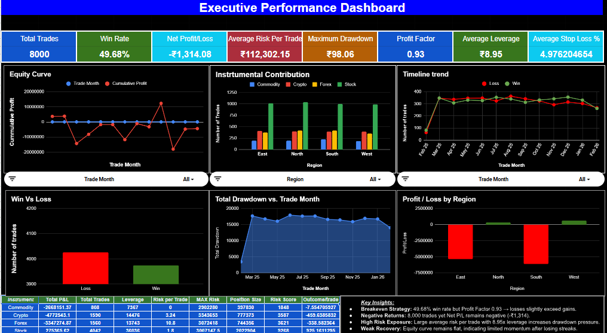
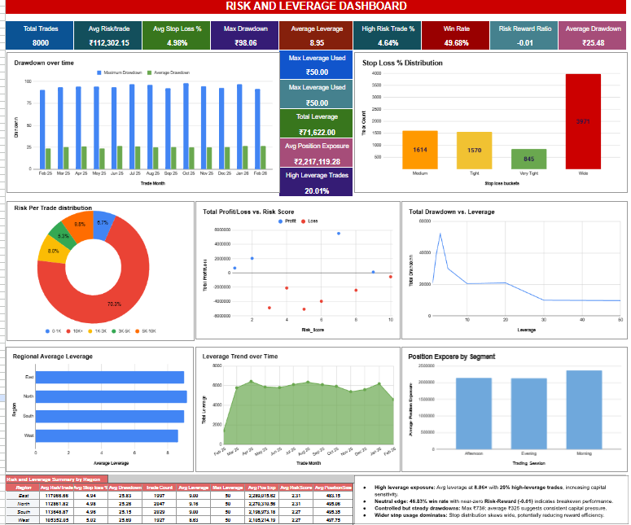
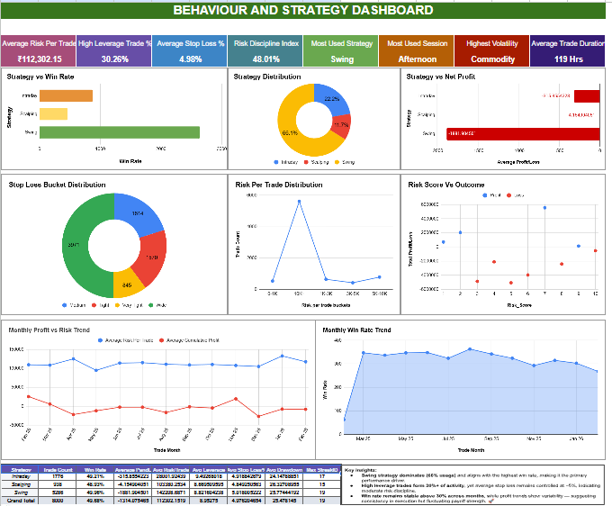
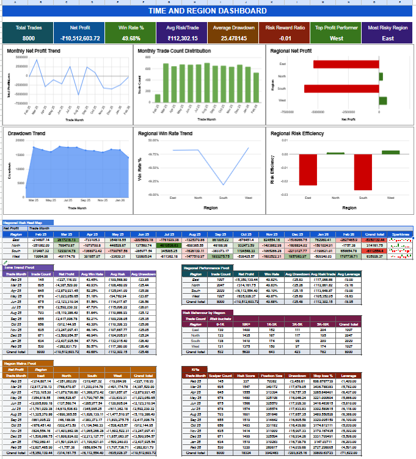

# Risk-Adjusted-Trading-Performance-Analytics-Dashboard

# 📊 Trading Performance Analytics Suite

## 🚀 Project Overview

A comprehensive multi-dashboard trading analytics system built in Google Sheets to evaluate performance, risk exposure, behavioral patterns, and time-region dynamics.

This project transforms trade-level raw data into structured business intelligence dashboards using Pivot Tables, KPI Cards, Risk Metrics, and Visual Analytics.

---

# 🧩 Dashboards Included

## 1️⃣ Executive Performance Dashboard
High-level summary for decision-makers.

### Key Metrics:
Net Profit
Total Trades
Maximum Drawdown
Profit Factor
Total Trades
Win Rate
Average Risk Per Trade
Average Stop Loss %

Purpose:
Provides a quick strategic overview of profitability and capital efficiency.

---

## 2️⃣ Risk & Leverage Dashboard
Focuses on capital protection and exposure control.

### Key Metrics:
Drawdown over time
Stop Loss % Distribution
Risk per Trade Distribution
Regional Average Leverage
Average Risk Per Trade
High Risk Trade %
Risk Reward Ratio

Purpose:
Identifies capital destruction zones and leverage risk concentration.

---

## 3️⃣ Behaviour & Strategy Dashboard
Analyzes trading psychology and system performance.

### Key Metrics:
Risk Discipline Index
Most Used Strategy
Most Used Session
High Volatility %
Strategy vs Win Rate
Strategy Distribution
Strategy vs Net Profit
Monthly Win rate trend

Purpose:
Detects behavioral biases and strategy effectiveness.

---

## 4️⃣ Time & Region Dashboard
Evaluates when and where performance is strongest.

### Key Metrics:
Top profit performer
Most Risky Region
Drawdown trend
Regional Risk Efficiency
Regional Net Profit
Regional Win Rate trend

Purpose:
Reveals temporal and geographic performance patterns.

—

## Dashboard Preview:

## Live Dashboard:
 [View Interactive Dashboard](https://docs.google.com/spreadsheets/d/1Wjzi99MgZxWTRGDvRZKm4xF0TSbiwpSnjmh6g5DRMDQ/edit?usp=sharing)

# 📊 Dataset Structure

The dataset includes:

- Trader_ID
- Region
- Account_Type
- Trade_ID
- Instrument
- Trade_Type
- Trade_Date
- Entry_Price & Exit_Price
- Profit_Loss
- Drawdown
- Position_Size
- Leverage
- Risk_per_Trade
- Stop Loss Metrics
- Strategy
- Trading_Session
- Risk Score
- Cumulative Profit

---

# 🛠 Tools & Techniques Used

- Google Sheets
- Pivot Tables
- QUERY Function
- INDEX-MATCH
- SUMIF / COUNTIF
- SPARKLINE
- Conditional Formatting (Heat Maps)
- KPI Cards
- Risk Efficiency Calculations

---

# 📈 Advanced Metrics Calculated

- Net Profit
- Win Rate (%)
- Average Drawdown
- Risk Efficiency Ratio
- Profit-to-Risk Ratio
- Leverage Exposure
- Strategy Effectiveness Score

—

# 📊 Pivot Architecture & Data Model

The analytical engine of this project is built on a structured multi-layer Pivot Table architecture.

The system consists of:

- 4 Master Pivots (One per Dashboard)
- 5 Sub-Pivots (Time & Region Deep Dive)
- Multiple Calculated Metrics derived from pivot outputs

---

# 🧩 Master Pivot Structure

Each dashboard is powered by a dedicated Master Pivot that aggregates raw trade-level data into high-level metrics.

📊 Executive Dashboard – Master Pivot
Rows:
Instrument

Key Metrics (Values):

Total P&L → SUM of Profit_Loss
Total Trades → COUNT of Trade_ID
Leverage → AVG / SUM
Risk per Trade → SUM
MAX Risk → MAX of Risk_per_Trade
Position Size → AVG / SUM
Risk Score → AVG
Outcome per Trade → AVG

🎯 Purpose
This pivot provides an instrument-level summary of:
Profitability
Trade frequency
Capital allocation
Risk concentration
Trade efficiency

It serves as the primary aggregation layer for executive KPIs and performance comparison across instruments.

—
🌍 Time & Region Dashboard – Regional Risk Pivot
Rows:
Region

Key Metrics (Values):

Avg Risk/Trade → AVG of Risk_per_Trade
Avg Stop Loss % → AVG of Stop_Loss_%
Avg Drawdown → AVG of Drawdown
Trade Count → COUNT of Trade_ID
Avg Leverage → AVG of Leverage
Max Leverage → MAX of Leverage
Avg Position Exposure → AVG of Position_Exposure
Avg Risk Score → AVG of Risk_Score
Avg Position Size → AVG of Position_Size

🎯 Purpose
This pivot provides a region-level view of:

Risk intensity
Capital exposure
Leverage behavior
Drawdown tendencies
Trading activity concentration

It enables identification of high-risk regions, leverage outliers, and capital efficiency differences across geographies.

—
🧠 Behaviour & Strategy Dashboard – Strategy Performance Pivot
Rows:
Strategy

Key Metrics (Values):

Trade Count → COUNT of Trade_ID
Win Rate → AVG of Win_Flag
Average P&L → AVG of Profit_Loss
Avg Risk/Trade → AVG of Risk_per_Trade
Avg Leverage → AVG of Leverage
Avg Stop Loss % → AVG of Stop_Loss_%
Avg Drawdown → AVG of Drawdown
Max Streak ID → MAX of Streak_ID

🎯 Purpose
This pivot provides a strategy-level evaluation of:

Profitability consistency
Risk deployment behavior
Leverage usage patterns
Drawdown control
Streak performance dynamics

It helps identify high-performing vs high-risk strategies, and supports risk-adjusted strategy comparison.

—
📈 Time & Region Dashboard – Monthly Net Profit Pivot
Rows:
Region

Columns:
Trade Month (Feb 25 – Feb 26)

Values:
Net Profit → SUM of Profit_Loss

Additional:
Grand Total → Total annual profit per region

Sparklines → Monthly profit trend visualization per region

🎯 Purpose
This pivot provides a time-series view of:
Monthly profit trends by region
Seasonal performance shifts
Region-wise profitability consistency
Volatility and recovery patterns

It enables quick identification of top-performing months, underperforming regions, and overall profit trajectory.

# 🔥 Key Insights Derived

- High win rate does not guarantee high profitability.
- Certain regions show strong profit-to-risk efficiency.
- Excess leverage correlates with higher drawdowns.
- Performance varies significantly by trading session.
- Behavioral streaks impact capital sustainability.

---

# 💡 Future Improvements

- Automated Data Refresh
- Sharpe Ratio & Sortino Ratio
- Python / Power BI Version
- Monte Carlo Simulation
- Risk-Adjusted Capital Allocation Model

---

# Author: Kavyananda K
Data Analyst

